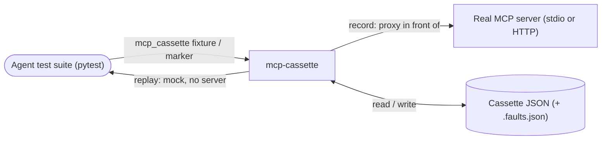
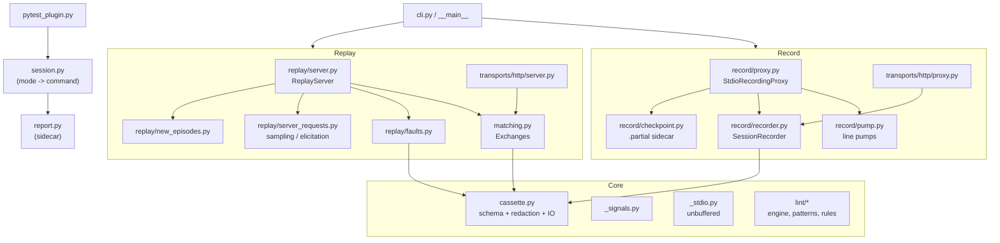
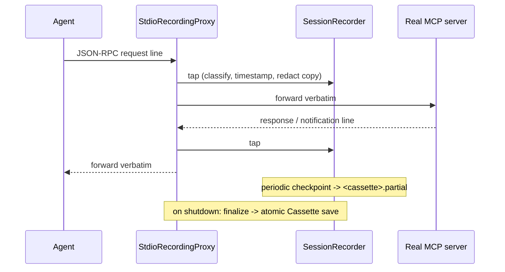
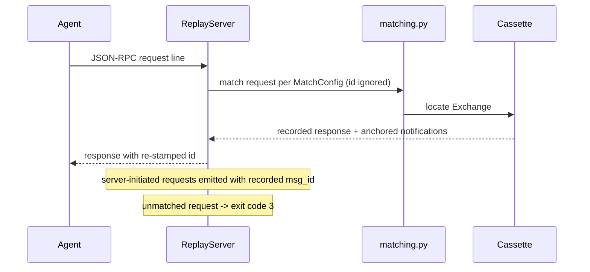
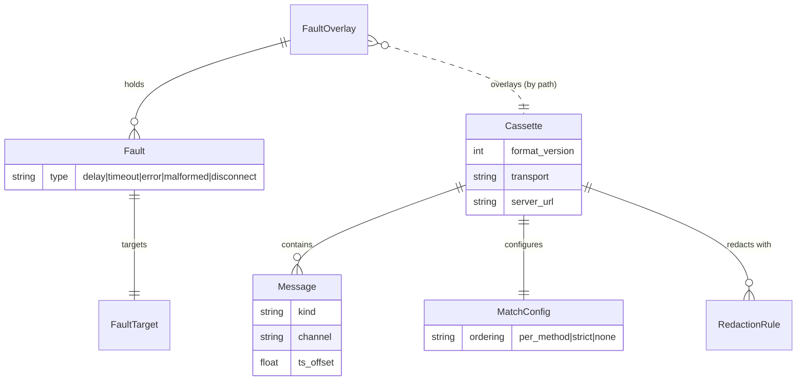

# Architecture

Living picture of `mcp-cassette` - "vcrpy for MCP". Record real MCP stdio/HTTP
sessions into cassettes, then replay them as deterministic mock servers. Diagrams
show what exists today; the Key Decisions log carries the durable "why".

## System context

Where the library sits between an agent test suite and a real MCP server.

## Components

Internal modules, grouped by record path, replay path, and shared core.

## Record flow

Transparent proxy taps both directions, classifies, redacts, and finalizes.

## Replay flow

Answers from the recording; no server, no network, no wall-clock in the path.

## Data model

Pydantic v2 schema. Faults live in a separate overlay and never mutate the cassette.

## Key Decisions

### 2026-07-18 - Operate at the transport level, never import the mcp SDK at runtime

**Status:** Accepted
**Context:** The library must work with any MCP client/server unmodified. Parsing
or validating against the `mcp` SDK would couple every consumer to it and break on
protocol drift.
**Decision:** Treat messages semi-opaquely - capture verbatim newline-delimited
JSON-RPC whatever the method. Runtime dependencies are only `anyio` and `pydantic`;
the `mcp` SDK is a dev-only dependency used by the reference test server.
**Consequences:** Works with any client unchanged and survives new methods for free.
The cost is no semantic validation of captured traffic - matching is structural over
parsed JSON, not schema-aware.

### 2026-07-18 - JSON-RPC id is never matched and always re-stamped

**Status:** Accepted
**Context:** Request ids vary per run and per client; matching on them would make
replay brittle.
**Decision:** Match structurally per `MatchConfig`; ignore the `id` entirely and
re-stamp the recorded response with the incoming request's id at replay time.
**Consequences:** Replay is stable across runs. Correlation relies on ordering
discipline (`per_method` default) rather than ids.

### 2026-07-18 - Faults live in a separate overlay; cassettes are immutable under faults

**Status:** Accepted
**Context:** One recording should drive a whole resilience matrix (timeouts, errors,
disconnects) without re-recording.
**Decision:** Keep faults in a `FaultOverlay` (in-memory or `<cassette>.faults.json`
sidecar), applied at replay time. The recorded cassette is never rewritten.
**Consequences:** One cassette powers many failure scenarios; the source of truth
stays pristine. Faults are resolved against the cassette at serve time.

### 2026-07-18 - Redact at capture time on a deep copy

**Status:** Accepted
**Context:** Secrets in traffic must never land in a cassette, but altering bytes in
flight would corrupt the live session.
**Decision:** Apply redaction rules to a deep copy at capture time; bytes forwarded
between agent and server are never modified. Defaults (`*token*`, `*secret*`,
`authorization`, ...) are always on unless disabled.
**Consequences:** Safe-by-default recordings; the live session is untouched.

### 2026-07-18 - Signal-driven shutdown that hard-exits instead of unwinding

**Status:** Accepted
**Context:** The client stdin read runs in an un-cancellable anyio `FileReadStream`
worker thread, so a targeted signal cannot interrupt it and a graceful task-group
unwind would hang waiting on it. asyncio has no `add_signal_handler` on Windows.
**Decision:** On interrupt both platforms converge on `_interrupt_shutdown`:
terminate the child, finalize the cassette, `os._exit(130)`. POSIX uses
`anyio.open_signal_receiver`; Windows uses a `signal.signal` SIGINT/SIGBREAK handler
polled by `_watch_signals_windows`. Off the main thread, shutdown degrades to
EOF-driven.
**Consequences:** No hangs on interrupt; cassette is finalized on the way out. The
hard exit discards subprocess coverage, so interrupt paths are covered in-process
with `os._exit` mocked.

### 2026-07-18 - Cross-process miss signalling via exit code 3 and a report sidecar

**Status:** Accepted
**Context:** Record/replay run in a separate process from the test, so failures must
cross the process boundary.
**Decision:** The replay server exits `3` on any unmatched request; a small JSON
report sidecar (`report.py`) is written by the subprocess and read back by the
fixture, which surfaces misses and empty recordings as test failures.
**Consequences:** Deterministic test failures on drift without shared memory. Adds a
sidecar file to the contract between fixture and subprocess.

### 2026-07-18 - Cassette format versioning is an integer, decoupled from package version

**Status:** Accepted
**Context:** The on-disk schema needs forward-compat gating independent of the
library's release version.
**Decision:** `FORMAT_VERSION` is an `int` embedded in every cassette; loading a
newer cassette raises `UnsupportedFormatVersion`. It advances one step per schema
change, not per release.
**Consequences:** Old readers reject unknown formats cleanly. The schema version does
not track the package version (e.g. package 0.2.0 still writes `format_version` 2).

### 2026-07-19 - v0.2.0: widen to HTTP transport and server-initiated requests

**Status:** Accepted
**Context:** v0.1.0 handled stdio only and refused cassettes containing sampling or
elicitation at load.
**Decision:** Add a Streamable HTTP transport (`transports/http/*`, `mcp-cassette[http]`
extra) with a recording reverse proxy and an offline mock HTTP server; SSE is
passthrough and `Mcp-Session-Id` is captured as evidence while replay issues a fresh
id. Add server-initiated request replay (`replay/server_requests.py`) with anchored
emission on the recorded `msg_id`, accept-anything response handling, and
release-on-response gating. Bump `FORMAT_VERSION` to 2 with optional HTTP metadata.
**Consequences:** Agents over HTTP and sampling/elicitation flows now record and
replay on both transports. `UnsupportedCassetteFeature` was removed from the public
API. HTTP support is an optional extra, keeping the core dependency set unchanged.

### 2026-07-19 - v0.2.0: crash-safety checkpoints during recording

**Status:** Accepted
**Context:** A hard kill mid-recording lost the whole session.
**Decision:** Periodically write the in-progress recording to a `<cassette>.partial`
sidecar (`--checkpoint-interval`, default 5s). Never write to the cassette path
itself, because `once` mode resolves record-vs-replay by that file's existence and a
truncated cassette there would replay as a finished one.
**Consequences:** A hard kill loses only the tail since the last checkpoint. Adds a
`.partial` sidecar during recording.

### 2026-07-19 - v0.2.0: cassette linting for third-party content

**Status:** Accepted
**Context:** Recorded tool descriptions and results are third-party content that
reaches a model and can carry prompt-injection or supply-chain risk.
**Decision:** Add `mcp-cassette lint` (`lint/*`: engine, patterns, rules) with
heuristic rules, `--baseline` drift detection, and `--format json`. Exposed
programmatically as `LintFinding` and `LintReport`.
**Consequences:** CI can gate on recorded-content drift. Rules are heuristic, not a
security guarantee.
