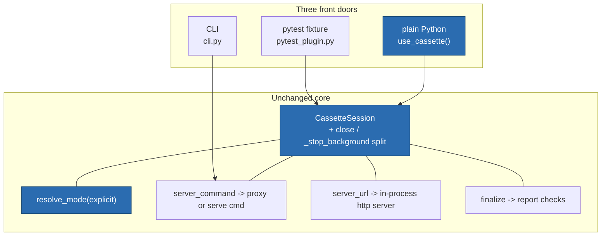

# ITER_01_v3 — Embedded library mode

## §01 · Concept

v1 and v2 shipped two front doors: the `mcp_cassette` **pytest fixture** and the
**CLI**. Every mechanism behind them is already pytest-free — `CassetteSession`
resolves the mode, builds the command or URL, and finalizes; the pytest plugin is a
114-line adapter that supplies a path, a mode, and a teardown call. The HTTP path
already runs a full replay server *in this process* on a background anyio portal.

v3 opens the **third door**: plain Python. A developer writing an agent harness, a
notebook, a benchmark runner, a CLI of their own, or a non-pytest test framework
imports `use_cassette`, gets a session, and plugs the returned command/URL into their
agent config — with the same modes, the same fault matrix, the same failure semantics.

```python
from mcp_cassette import use_cassette

with use_cassette("cassettes/search.mcp.json", mode="once") as session:
    cmd = session.server_command(["python", "-m", "my_server"])
    run_my_agent(mcp_servers={"search": {"command": cmd[0], "args": cmd[1:]}})
# clean exit -> finalize(): background server stopped, report checked,
#               CassetteError raised on an empty recording or any replay miss
```

**The one asymmetry, stated up front rather than discovered:** for stdio, "library mode"
means *we hand you a command list* — exactly what the fixture does — because an MCP
stdio server **is** a program the client launches, and the only seam is which command it
launches. Only Streamable HTTP gets an in-process server (`server_url`), because an HTTP
config carries no command at all: something must already be listening before the agent
connects, so running it ourselves is the minimum, not a preference.

Replaying stdio *without* a child process is not impossible — it would need the client
to accept in-memory streams instead of spawning, which the Python `mcp` SDK's
`ClientSession(read_stream, write_stream)` does support. It is **out of scope for v3**
on cost/benefit: it buys ~30–50 ms per test and debugger reachability, applies only to
agents wired directly against the SDK (anything configured by JSON `command`/`args`
cannot use it), and needs SDK-shaped types — so it would have to live behind an optional
`mcp-cassette[sdk]` extra, exactly as HTTP lives behind `[http]`. The no-runtime-SDK
invariant bans a *runtime* dependency, not an optional extra, so this stays a deliberate
deferral (ITER_04_v3 § Out of MVP scope), not a wall.

## §02 · Architecture



**Cassette schema: unchanged.** v3 adds no fields and does not move
`format_version` (stays 2). Nothing in this iteration touches record or replay
behavior — it is an entry-point and export change over existing machinery.

### Data model (configuration objects only — nothing persisted)

| Entity | v3 change |
|---|---|
| `Cassette`, `Message`, `MatchConfig`, `RedactionRule`, `Fault`, `FaultOverlay`, `FaultTarget` | unchanged |
| `CassetteSession` | gains `close()` (stop the in-process server, no report checks); `finalize()` becomes `close()` + the existing report checks. `_stop_background()` stays private and is called only by `close()` |
| `Mode` | unchanged type alias `Literal["once","none","all","new_episodes"]`, now **exported** |
| `CassetteError` | unchanged, now **exported** (it is raised by `finalize()`, so a non-pytest caller cannot currently catch it by name) |

### Public API surface added

| Symbol | Signature | One-liner |
|---|---|---|
| `use_cassette` | `use_cassette(cassette, *, mode=None, match=None, faults=None, report_path=None) -> ContextManager[CassetteSession]` | The library front door; finalizes on clean exit |
| `resolve_mode` | `resolve_mode(explicit: str \| None = None) -> Mode` | `MCP_CASSETTE_MODE` env > `explicit` > `"once"`, validated |
| `CassetteSession.close` | `close() -> None` | Stop the in-process HTTP server without report checks |
| `CassetteError` | exception | Already raised; now importable from the package root |
| `Mode` | type alias | For callers annotating their own wrappers |
| `lint_cassette` | `lint_cassette(cassette, baseline=None, rules=None, *, ignore=None) -> LintReport` | Re-export of `lint.run` — lint is a library call, not only a CLI |

No HTTP routes, no auth, no persistence added. The in-process HTTP replay server keeps
binding `127.0.0.1` on an ephemeral port and serving non-browser MCP clients; CORS
remains deliberately unimplemented (SKELETON_v2 § 02).

## §03 · Tech Stack

> Unchanged — see SKELETON_v2 § 03. No new dependency: `contextlib`, `os`, and
> `tempfile` are stdlib. Runtime deps stay `anyio` + `pydantic`, with `httpx` + `h11`
> behind the `[http]` extra.

## §04 · Backend

### New/changed modules

- `session.py` — real, additive:
  - `resolve_mode(explicit: str | None = None) -> Mode`, module-level. Reads
    `MCP_CASSETTE_MODE` at call time (never cached, so `monkeypatch.setenv` and
    per-run env changes behave), falls back to `explicit`, then `"once"`. An
    unrecognized value raises `ValueError` naming the four valid modes and the source
    it came from (`env MCP_CASSETTE_MODE` vs `mode=` argument).
  - `CassetteSession.close()` — stops the background portal/server if one was started
    (idempotent; safe when `server_url` was never called). `finalize()` becomes
    `self.close()` followed by the existing `fatal_error` / empty-recording / miss
    checks, so its behavior is byte-for-byte what v2 shipped.
  - `use_cassette(...)` — a `@contextmanager`. Body:

    ```python
    @contextmanager
    def use_cassette(
        cassette: str | os.PathLike[str],
        *,
        mode: str | None = None,
        match: MatchConfig | None = None,
        faults: FaultOverlay | None = None,
        report_path: str | os.PathLike[str] | None = None,
    ) -> Iterator[CassetteSession]:
        """Record/replay an MCP session from plain Python code."""
        path = Path(cassette)
        tmp_dir: tempfile.TemporaryDirectory[str] | None = None
        if report_path is None:
            tmp_dir = tempfile.TemporaryDirectory(prefix="mcp-cassette-")
            report_path = Path(tmp_dir.name) / "report.json"
        session = CassetteSession(
            mode=resolve_mode(mode),
            cassette_path=path,
            match=match,
            faults=faults,
            report_path=Path(report_path),
        )
        try:
            yield session
        except BaseException:
            session.close()   # never mask the caller's exception with a report check
            raise
        else:
            session.finalize()
        finally:
            if tmp_dir is not None:
                tmp_dir.cleanup()
    ```

- `pytest_plugin.py` — `_resolve_mode` keeps its four-tier precedence (env > marker >
  ini > `"once"`) but delegates validation to `session.resolve_mode`, so the two doors
  cannot drift on what a valid mode is. Fixture behavior is unchanged.
- `__init__.py` — `__all__` gains `CassetteError`, `Mode`, `use_cassette`,
  `resolve_mode`, `lint_cassette`. Per the public-API convention this is a **minor**
  version bump (0.3.0): additive only, nothing renamed or removed.

### Decisions this iteration pins down

1. **Exception path never masks the caller's error.** If the `with` body raises, the
   session is `close()`d (so no portal thread or bound socket leaks) and the original
   exception propagates untouched. Report checks — which would raise `CassetteError`
   about misses — are skipped, because a miss is usually a *consequence* of the real
   failure, and chaining it on top buries the cause. Documented in the docstring.
2. **Report sidecar goes to a temp dir, not next to the cassette.** `CassetteSession`
   defaults `report_path` to `<cassette>.report.json`; that is right for the fixture
   (which passes `tmp_path` anyway) but wrong for library callers, who would find
   untracked JSON next to cassettes they commit. `use_cassette` therefore creates a
   `TemporaryDirectory` and removes it on exit. The faults sidecar derives from
   `report_path.parent`, so it lands in the same temp dir and is cleaned up with it.
   Passing `report_path=` explicitly opts back into a durable file.
3. **Mode precedence is deliberately shorter than the fixture's.** Library callers have
   no marker and no ini, so the chain is env > argument > `"once"`. `MCP_CASSETTE_MODE`
   stays the top tier so the CI invariant (`MCP_CASSETTE_MODE=none` forbids recording)
   holds identically through the library door — a harness cannot silently record in CI
   by hard-coding `mode="all"`.
4. **Nesting is allowed, sharing is not.** Two `use_cassette` blocks may be open at once
   (different cassettes, e.g. two MCP servers in one agent); each owns its own session,
   portal, and temp dir. Two sessions on the *same* cassette path concurrently is
   unsupported and undetected — documented, not policed, because the check would cost
   process-global state for a mistake that surfaces immediately as a miss.
5. **No async variant.** `async with use_cassette_async(...)` is deferred (see
   ITER_04_v3 § Out of MVP scope). The blocking portal works from async callers today
   as long as it is entered from a thread that is not the event loop; the docs say so
   rather than adding a second entry point on speculation.

### Gotchas addressed proactively

- **Cached config breaks tests** (see gotchas § Backend): `resolve_mode` reads
  `os.environ` on every call and nothing is cached at module import, so a caller that
  sets `MCP_CASSETTE_MODE` after import gets the new value.
- **Implicit resource creation race**: the background HTTP server is started only by an
  explicit `server_url()` call, never lazily by `__enter__`, so `close()` has nothing
  to race against when `server_url` was never called.
- **Volume mounts / packaging**: none — this iteration adds no files outside `src/`.

### Tests for this iteration

- `tests/unit/test_library_api.py`: `resolve_mode` precedence (env beats argument;
  argument beats default; invalid value in either source raises `ValueError` naming the
  source); `use_cassette` yields a session whose mode matches; clean exit calls
  `finalize`; a raising body propagates the original exception and does **not** raise
  `CassetteError`; the temp report dir is gone after exit; an explicit `report_path` is
  left on disk; `close()` is idempotent.
- `tests/integration/test_library_stdio.py`: `use_cassette` + `server_command` against
  the reference server via `scripted_client` — first run records, second run replays,
  a third run under `mode="none"` with a deleted cassette raises `CassetteError`; a
  deliberate extra request in replay raises the miss `CassetteError` with the offending
  method in the message.
- `tests/integration/test_library_http.py`: `use_cassette` + `server_url` against the
  reference HTTP server (record then replay); after the block, the bound port is closed
  (a connect attempt fails) — proves `close()` really tears the portal down.
- `tests/system/`: unchanged; one added assertion that the fixture and `use_cassette`
  resolve the same mode for the same env value.

### Run locally

```
uv sync --extra http && uv run pytest
uv run python examples/library_mode.py          # records once, replays thereafter
```

Environment variables: none added (`MCP_CASSETTE_MODE` only, as since v1).

## §05 · Frontend / Developer Surface

No GUI. The surfaces are the CLI, the fixture, and — from this iteration — the library.

- **New developer surface:** `use_cassette` and the five new exports above. The CLI
  gains nothing this iteration; the fixture's observable behavior is unchanged.
- **Docs, written with the feature (not after):**
  - `docs/guide/how-to/use-as-a-library.md` — the third door end to end: stdio command
    substitution, HTTP URL substitution, mode/env precedence, what `finalize()` raises
    and when, the temp-report-sidecar behavior, and the stdio in-process limitation
    stated plainly with its reason.
  - `docs/guide/index.md` — the how-to list gains the new page.
  - `README.md` — a "Use it as a library" section between the pytest and CLI sections,
    with the eight-line example from § 01.
  - `examples/library_mode.py` — a runnable script (stdio, reference server) that a
    reader can execute after `uv sync`.
- **Failure-message convention carries:** `ValueError` from `resolve_mode` names the
  bad value, its source, and the four valid modes; the existing `CassetteError` texts
  (missing cassette under `none`, empty recording, miss list) are already
  cause-plus-fix and are reused verbatim.
