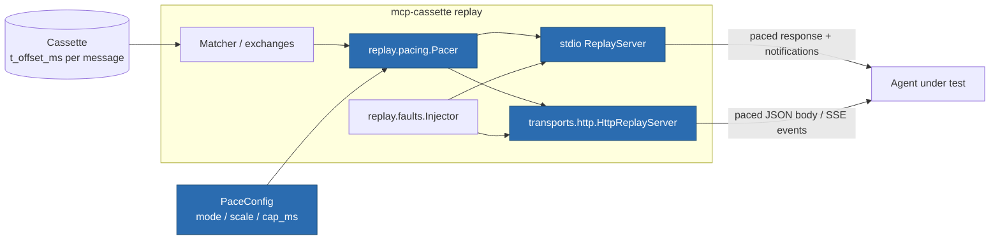

# ITER_02_v3 — Replay pacing

## §01 · Concept

Every recorded message already carries `t_offset_ms` — milliseconds from proxy start on
a monotonic clock — and replay has always ignored it. Responses come back instantly.
That is the right default (fast, deterministic suites) and it stays the default.

But instant replay silently hides a whole class of agent bug: timeout handling,
progress-notification UX, concurrency assumptions ("the second tool call can't have
returned before the first"), and retry/backoff logic all behave differently when the
server answers in 800 ms instead of 0. Faults cover *pathological* latency (a `delay`
fault you write by hand); pacing covers **realistic** latency — the timing the real
server actually exhibited, replayed as recorded.

v3 makes that opt-in: `--pace recorded` replays the recorded gaps, `--pace-scale`
fast-forwards or slows them, and `--pace-cap-ms` keeps one pathological recorded pause
from stalling a suite.

## §02 · Architecture



**Cassette schema: unchanged** (`format_version` stays 2). Pacing reads a field that
has existed since v1; it writes nothing.

### Data model — one new configuration entity

`PaceConfig` lives in `cassette.py` beside `MatchConfig`, for the same reason
`MatchConfig` does: it is replay policy that must serialize and cross a process
boundary, and callers configure both in the same breath.

| Entity | Fields |
|---|---|
| `PaceConfig` (new, pydantic) | `mode: Literal["none","recorded"] = "none"`; `scale: float = 1.0` (must be `> 0`, validated); `cap_ms: int = 5000` (per-gap upper bound; `0` = uncapped) |
| `MatchConfig` | unchanged — matching stays timing-independent, exactly as it is transport-independent |
| `Fault` / `FaultOverlay` | unchanged fields; interaction with pacing pinned below |

### API surface changed

| Surface | Change |
|---|---|
| `ReplayServer(cassette, match=, faults=, report_path=)` | gains `pace: PaceConfig \| None = None` |
| `HttpReplayServer(...)` | gains `pace: PaceConfig \| None = None` |
| `NewEpisodesProxy(...)` | gains `pace: PaceConfig \| None = None` (paced on matched replays only) |
| `CassetteSession(...)` | gains `pace: PaceConfig \| None = None`; emitted as CLI flags by `server_command`, passed as an object by `server_url` |
| `use_cassette(...)` | gains `pace: PaceConfig \| None = None` |
| CLI `serve` | gains `--pace {none,recorded}`, `--pace-scale FLOAT`, `--pace-cap-ms N` |
| pytest marker | gains `pace=`, `pace_scale=`, `pace_cap_ms=` |
| `__init__.__all__` | gains `PaceConfig` |

## §03 · Tech Stack

> Unchanged — see SKELETON_v2 § 03. Pacing is `anyio.sleep` plus arithmetic on a field
> already in the cassette. No new dependency, and none possible — sleeping is the whole
> mechanism.

## §04 · Backend

### New/changed modules

- `replay/pacing.py` — new, ~50 lines, the entire mechanism:

  ```python
  class Pacer:
      """Translates recorded t_offset_ms gaps into replay-time sleeps."""

      def __init__(self, config: PaceConfig | None = None) -> None: ...

      @property
      def enabled(self) -> bool:
          """True when config.mode == "recorded"."""

      def gap_ms(self, previous: Message | None, current: Message) -> float:
          """Scaled, clamped delay to apply before emitting `current`.

          Returns 0.0 when disabled, when `previous` is None, or when the recorded
          gap is negative (clock skew or reordered capture). Otherwise
          (current.t_offset_ms - previous.t_offset_ms) * scale, clamped to cap_ms
          when cap_ms > 0.
          """

      async def wait(self, previous: Message | None, current: Message) -> None:
          """Sleep gap_ms() milliseconds; a no-op (no clock read) when disabled."""
  ```

- `replay/server.py` (stdio) — one `await self._pacer.wait(prev, msg)` at each emission
  point, with `prev` being the message the recorded stream showed immediately before:
  - before a matched response: `prev = exchange.request`;
  - before each anchored notification: `prev` = the previously emitted recorded message
    of that exchange (so a burst of progress notifications keeps its recorded rhythm);
  - before each server-initiated request (`_emit_server_requests`): same rule, anchored
    to the recorded predecessor.
  Nothing else in the file changes — the fault path, the gating path, and `_send` are
  untouched, and the deferred-gated response path inherits pacing for free because it
  calls the same helpers.
- `transports/http/server.py` — the same three emission points, plus the one that only
  exists here: **SSE event spacing**. Events within one streamed response are emitted
  with their recorded inter-event gaps, which is the highest-fidelity thing pacing buys
  (an agent consuming a progress stream sees it arrive as it originally did).
- `replay/new_episodes.py` — paced on replayed hits; fall-through misses go to the real
  server and are inherently live-timed. Stated in `--help` and the guide.
- `cassette.py`, `session.py`, `pytest_plugin.py`, `cli.py`, `__init__.py` — plumbing
  for the surfaces in § 02.

### Decisions this iteration pins down

1. **Off by default, and the default path is untouched.** With `mode="none"` (the
   default everywhere), `Pacer.wait` returns without awaiting and without reading a
   clock. The v1/v2 invariant — *"no network, no subprocess, no wall-clock reads in the
   response path"* — therefore still holds exactly as written for every existing user.
   CLAUDE.md's invariant gets one clause added this iteration: *"…unless pacing is
   explicitly enabled (`PaceConfig.mode="recorded"`), which trades that determinism for
   recorded-latency fidelity by design."* Recording an invariant's deliberate exception
   is cheaper than letting a future reader think pacing violated it by accident.
2. **Pacing comes before faults.** Order at an emission point is: pace, then apply the
   fault. A `delay` fault is therefore *additive* on top of recorded latency (recorded
   800 ms + injected 2000 ms = 2800 ms), which is what "the server was already slow and
   then got slower" should mean. `timeout` never responds, so its pacing sleep is
   skipped entirely rather than wasting wall time before silence. `disconnect` paces
   first — the connection drops after the recorded latency, which is the realistic
   shape. `error` and `malformed` pace normally.
3. **`cap_ms` defaults to 5000, not unlimited.** A cassette recorded interactively can
   easily contain a 40-second human pause between calls; replaying that verbatim by
   default would turn one opt-in flag into a hung CI job. 5 s per gap is long enough to
   exercise realistic timeout logic and short enough to never look like a hang.
   `--pace-cap-ms 0` opts into uncapped replay explicitly.
4. **Gaps, not absolute offsets.** Pacing never tries to reproduce the absolute recorded
   timeline (which would require the client to send requests at recorded times — it
   won't). Each sleep is the gap between two adjacent recorded messages, applied at the
   moment the later one is emitted. This composes correctly when the live client is
   slower or faster than the recorded one, and it degrades to zero for messages with
   equal offsets.
5. **Negative and missing gaps are zero, silently.** Concurrent POSTs on HTTP can
   interleave such that a response's recorded offset precedes its request's. Clamping to
   zero is right and needs no warning: it means "as fast as possible", which is the
   pre-v3 behavior for that pair.
6. **`scale` is validated, not clamped.** `scale <= 0` raises a pydantic validation
   error naming the field. Zero would be indistinguishable from `mode="none"` but reads
   as a mistake, so it is rejected rather than silently accepted.

### Gotchas addressed proactively

- **Sequential/concurrent emission**: the stdio server's deferred gated responses write
  concurrently with the read loop under `_out_lock`. Pacing sleeps happen **outside**
  that lock, so one paced response never blocks an unrelated one from being framed;
  only the `out.send` call itself is serialized, exactly as today.
- **SSE heartbeat composition** (see gotchas § LLM): the HTTP server does not add
  keep-alive pings, so paced SSE gaps cannot collide with a heartbeat producer. If a
  recorded gap exceeds a proxy's idle timeout in some future deployment, that is what
  `cap_ms` is for; documented in the guide.
- **Cached config breaks tests**: `PaceConfig` is constructed per session and never
  cached module-level, matching `MatchConfig`.

### Tests for this iteration

- `tests/unit/test_pacing.py`: `gap_ms` arithmetic — scale applied, `cap_ms` clamps,
  `cap_ms=0` uncapped, negative gap → 0, `previous=None` → 0, disabled → 0; `scale=0`
  and `scale=-1` raise validation errors; `wait()` with pacing disabled never calls
  `anyio.sleep` (monkeypatched sentinel) — the "no clock read on the default path"
  assertion, enforced by test rather than by comment.
- `tests/integration/test_replay_pacing.py`: a hand-built cassette with 300 ms gaps
  replayed through `serve --pace recorded` — measured elapsed (monotonic) is at least
  the sum of gaps and comfortably below a generous ceiling; `--pace-scale 0.1` finishes
  an order of magnitude faster; `--pace-cap-ms 50` bounds a planted 5-second gap; the
  same cassette without `--pace` finishes near-instantly. Bounds are asymmetric
  (tight floor, loose ceiling) so the test cannot flake on a loaded CI runner.
- `tests/integration/test_http_pacing.py`: SSE inter-event gaps observed by a scripted
  httpx client match the recorded gaps within tolerance; a paced HTTP response arrives
  no earlier than its recorded latency.
- Fault interaction: `delay` fault + pacing is additive; `timeout` fault spends no
  pacing sleep (elapsed stays near zero before the session ends).
- `tests/system/`: a marker-driven test (`@pytest.mark.mcp_cassette(pace="recorded",
  pace_scale=0.2)`) proves the flags reach the subprocess, via pytester.

### Run locally

```
uv run mcp-cassette serve demo.mcp.json --pace recorded --pace-scale 0.5
uv run mcp-cassette serve demo.mcp.json --pace recorded --pace-cap-ms 0   # uncapped
```

Environment variables: none added.

## §05 · Frontend / Developer Surface

- **CLI:** three new `serve` flags. `--help` states the honest framing in one line:
  *"replay recorded inter-message latency (default: off — replay is instant)"*, and
  `--pace-cap-ms` documents its 5000 ms default and the `0` escape hatch.
- **Fixture:** `@pytest.mark.mcp_cassette(pace="recorded", pace_scale=0.2, pace_cap_ms=1000)`.
- **Library:** `use_cassette("c.mcp.json", pace=PaceConfig(mode="recorded", scale=0.2))`.
- **Docs:** new `docs/guide/how-to/replay-timing.md` — when to turn pacing on (timeout
  logic, progress-stream UX, retry/backoff), why it is off by default, the fault
  interaction table from § 04 decision 2, and the cap rationale. `docs/guide/index.md`
  and `docs/guide/operations/cli-reference.md` gain the flags; `README.md` gains two
  lines under replay options. Per CLAUDE.md, the guide is updated in this iteration —
  not deferred — because flags and defaults changed.
- **Failure-message convention:** invalid `--pace-scale` exits 2 naming the flag and the
  constraint (`must be > 0`); `--pace-scale`/`--pace-cap-ms` given without
  `--pace recorded` exits 2 saying the flags have no effect without it, rather than
  silently ignoring them.
