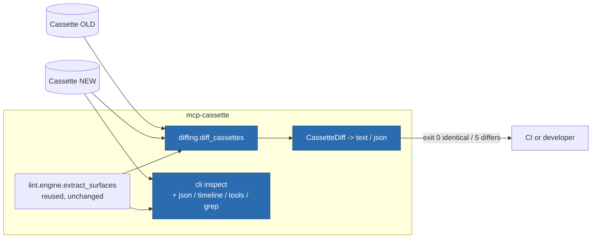

# ITER_03_v3 — Inspect and diff

## §01 · Concept

`inspect` today answers one question — *what is roughly in this file?* — with a fixed
header, a per-method count, and a timing span. The two questions developers actually
hit are unanswered:

1. **"What happened, in order?"** When a replay misses, or an agent behaves oddly, you
   need the message timeline: who sent what, when, with which id. Today that means
   opening a 4000-line JSON file.
2. **"What changed between these two recordings?"** Re-recording after a server upgrade
   produces a new cassette; the interesting content is the delta — new methods, changed
   tool descriptions, a reordered exchange sequence. `git diff` on the raw JSON drowns
   it in re-stamped ids and shifted offsets.

v3 answers both: `inspect` grows a JSON format, a timeline view, a tool view, and a
payload grep; and a new `diff` subcommand renders the structural delta between two
cassettes, with an exit code CI can gate on.

`diff` and lint's R002 deliberately overlap and are deliberately different: **R002 is a
gate** (error severity, tool descriptions and schemas only, exit 4 for CI) while
**`diff` is descriptive** (everything that changed, no severity, exit 5 as a signal a
human reads). Neither replaces the other; the guide says so in one line.

## §02 · Architecture



**Cassette schema: unchanged.** Both surfaces are read-only over cassettes — the same
stance lint took in ITER_04_v2: a cassette is never mutated or annotated.

### Data model — one new report entity (output only, never persisted in a cassette)

| Entity | Fields |
|---|---|
| `CassetteDiff` (new, pydantic) | `old: Path`, `new: Path`, `metadata: list[FieldChange]`, `methods: list[MethodDelta]`, `tools: list[ToolChange]`, `sequence: list[str]` (unified-diff lines of the exchange method sequence), `identical: bool` |
| `FieldChange` (new) | `field: str` (e.g. `"transport"`, `"protocol_version"`, `"server_info.version"`), `old: str \| None`, `new: str \| None` |
| `MethodDelta` (new) | `method: str`, `old_count: int`, `new_count: int` |
| `ToolChange` (new) | `tool: str`, `change: Literal["added","removed","description","input_schema"]`, `diff: list[str]` (unified-diff lines; empty for added/removed), `locator: str` (JSON pointer into the **new** cassette, or the old one for `removed`) |

`ToolSurface` and `ResultText` (ITER_04_v2, `lint/rules.py`) are reused as-is —
`diff` imports `lint.engine.extract_surfaces` rather than re-deriving tool surfaces, so
the two subcommands can never disagree about what a tool surface is.

### API surface changed

| Surface | Change |
|---|---|
| CLI `inspect` | gains `--format {text,json}`, `--timeline`, `--tools`, `--grep PATTERN` (existing `--method` and `--faults` unchanged) |
| CLI `diff OLD NEW` | new; `--format {text,json}`, `--tools-only`. Exit 0 identical, 5 differences, 2 load/usage error |
| `diffing.diff_cassettes(old, new) -> CassetteDiff` | new public function — diffing is a library call too |
| `__init__.__all__` | gains `CassetteDiff`, `diff_cassettes` |

## §03 · Tech Stack

> Unchanged — see SKELETON_v2 § 03. `difflib`, `json`, `re`, and `collections.Counter`
> are stdlib and already imported elsewhere in the tree; `difflib` is already used by
> lint R002. No new dependency.

## §04 · Backend

### New/changed modules

- `diffing.py` — new, top-level (peer of `matching.py`; it is neither record nor
  replay). Contains the four models above and `diff_cassettes`. Comparison order:
  1. **Metadata** — `transport`, `protocol_version`, `server_info.name/.version`,
     and for http cassettes the server *host* only (never the full URL, matching
     `inspect`'s existing host-only policy so a diff cannot leak a query-string token).
  2. **Method counts** — `Counter` over `method or f"<{kind}>"` on both sides;
     emitted for every method whose counts differ, sorted by method name.
  3. **Tool surfaces** — via `extract_surfaces`; last-seen wins per name (same rule
     R002 uses). Added, removed, description-changed (with unified diff), and
     `inputSchema`-changed (compared by `json.dumps(sort_keys=True)`, as R002 does).
  4. **Exchange sequence** — the ordered list of request methods on each side,
     rendered with `difflib.unified_diff` so a reordering or an inserted call is
     visible as a hunk rather than as count noise.
  `identical` is `True` when all four collections are empty.
- `cli.py` — `inspect` grows four flags; `diff` is registered as a fifth subcommand.
  `_cmd_inspect` is split into `_inspect_summary`, `_inspect_timeline`, `_inspect_tools`
  and a JSON assembler, because one function rendering four views by branching is how
  this file becomes unreadable.
- `report.py`, `cassette.py`, replay, record: untouched.

### The new `inspect` views, pinned precisely

- `--timeline` — one line per message, after `--method`/`--grep` filtering:

  ```
  seq   t_offset_ms  dir  kind          method                 id      bytes
  0             0    ->   request       initialize             1          214
  1            37    <-   response       -                     1          486
  2            38    ->   notification  notifications/initialized -        62
  ```

  `dir` is `->` for client→server and `<-` for server→client. `id` is the recorded
  `msg_id` (`-` when absent). `bytes` is the serialized payload length — the cheap
  proxy for "this response was huge" that a summary hides. For http cassettes two
  extra columns, `exch` and `chan`, are appended (they are `None` for stdio and would
  be dead columns there).
- `--tools` — one line per recorded tool, deduplicated by name, last-seen wins:
  `name  (n args)  first line of description`. Reuses `extract_surfaces`.
- `--grep PATTERN` — a Python regex matched against the compact JSON serialization of
  each message payload; composes with `--method` (AND). Invalid regex exits 2 naming
  the pattern and the `re` error.
- `--format json` — a single deterministic document: the summary fields, the method
  counts (sorted), the timing span, the tool list (sorted by name), and — when
  `--timeline` is also given — the timeline rows. Keys are sorted and floats are
  absent, so output is byte-stable for a given input and diffable in CI artifacts,
  the same determinism promise lint made in ITER_04_v2.

### Decisions this iteration pins down

1. **`diff` ignores what replay ignores.** JSON-RPC ids, `t_offset_ms`, and
   `Message.seq` are never compared — they are re-stamped or clock-derived, and
   including them would make every re-recording differ. This mirrors the standing
   invariant that ids are never matched on. Stated in `--help`, because a diff tool
   that silently ignores fields must say which ones.
2. **Exit 5, not 1 or 4.** 0/2/3/4 are taken (clean, usage/load error, replay miss,
   lint findings). `diff` gets 5 so a CI script can distinguish "cassettes differ"
   from "lint found a smell" from "the file wouldn't load".
3. **`diff` compares recordings, not sessions.** Two cassettes of the *same* server
   recorded from different agent runs will differ in exchange sequence; that is a true
   difference, not a false positive, and the text output's section headers make which
   dimension differed obvious at a glance. `--tools-only` is the flag for "I only care
   whether the server's surface changed", which is the common CI use.
4. **No pager, no color, no TUI.** Output is plain lines to stdout. A cassette timeline
   is `grep`-able and `less`-able with the tools the operator already has; adding
   rendering machinery to a library whose entire pitch is "two runtime dependencies"
   would be the wrong trade. Deferred explicitly in ITER_04_v3 § Out of MVP scope.
5. **Host-only for http provenance, everywhere.** `inspect` already prints only
   `urlsplit(server_url).netloc`; `diff` and `inspect --format json` follow the same
   rule rather than emitting `server_url`. Recording policy already refuses to store
   headers; this keeps the *reporting* surface from becoming the leak.

### Gotchas addressed proactively

- **References that aren't defined anywhere**: `diffing.py` imports only
  `Cassette`, `lint.engine.extract_surfaces`, and stdlib — no new coupling between
  lint and the CLI beyond the one function, which is already public within the package.
- **Resource ownership / 403-vs-404 analog**: not applicable (no server surface added).
- **Sequential id assignment**: not applicable — `diff` assigns no ids.
- **Large-file behavior**: `inspect --timeline` streams line by line from an already
  fully-loaded `Cassette`; no attempt at incremental parsing, because cassettes are
  test fixtures measured in megabytes at worst. Stated so it isn't mistaken for an
  oversight.

### Tests for this iteration

- `tests/unit/test_diffing.py`: identical cassettes → `identical=True`, empty
  collections; changed `server_info.version` → one `FieldChange`; an added tool → one
  `ToolChange(change="added")` with no diff lines; a changed description → unified-diff
  lines; a changed `inputSchema` → its own change entry; a reordered exchange sequence
  → sequence hunks with unchanged method counts; differing ids/offsets/seq alone →
  `identical=True` (the invariant from decision 1, enforced by test); v1 stdio cassette
  vs v2 http cassette of the same server → tool changes empty (cross-version comparison
  works, as R002's does).
- `tests/unit/test_inspect_views.py`: timeline row shape for stdio and http (extra
  columns present only for http); `--grep` filters and composes with `--method`;
  invalid regex exits 2; `--tools` dedupes by name; `--format json` output is
  byte-identical across two runs and round-trips through `json.loads`.
- `tests/integration/test_cli_diff.py`: `diff` on two recorded cassettes of the
  reference server (one with a modified tool description) exits 5 and names the tool;
  identical files exit 0; a missing file exits 2 naming the path;
  `--tools-only` on cassettes differing *only* in sequence exits 0.

### Run locally

```
uv run mcp-cassette inspect demo.mcp.json --timeline --grep 'tools/call'
uv run mcp-cassette inspect demo.mcp.json --format json > summary.json
uv run mcp-cassette diff old.mcp.json new.mcp.json --tools-only
```

Environment variables: none added.

## §05 · Frontend / Developer Surface

- **CLI:** four new `inspect` flags and one new subcommand, all visible in `--help`
  from this iteration.
- **Text output, one finding per line, cause and evidence together** — the standing
  convention. `diff`'s text form is four labelled sections, each omitted when empty:

  ```
  metadata:
    server_info.version: 1.4.0 -> 1.5.0
  methods:
    tools/call: 3 -> 4
  tools:
    search: description changed (+2 -1 lines)
      --- baseline
      +++ current
      ...
  sequence:
    @@ -3,4 +3,5 @@
    +tools/call
  ```

- **Docs:** `docs/guide/how-to/inspect-and-diff.md` (new) — reading a timeline when a
  replay misses, grepping payloads, wiring `diff --tools-only` as a CI step next to
  `lint`, and the one-line statement of how `diff` and R002 differ.
  `docs/guide/operations/cli-reference.md` gains the flags, the `diff` subcommand, and
  exit code 5; `docs/guide/troubleshooting.md` gains "a replay missed — read the
  timeline" pointing at the new view; `README.md` gains the two example commands.
- **Failure-message convention:** load errors name the path (existing behavior reused);
  an invalid `--grep` regex names the pattern and the `re` error text; `--tools-only`
  with `--format json` emits the same document with the non-tool sections empty rather
  than erroring, so scripts can pass the flag unconditionally.
