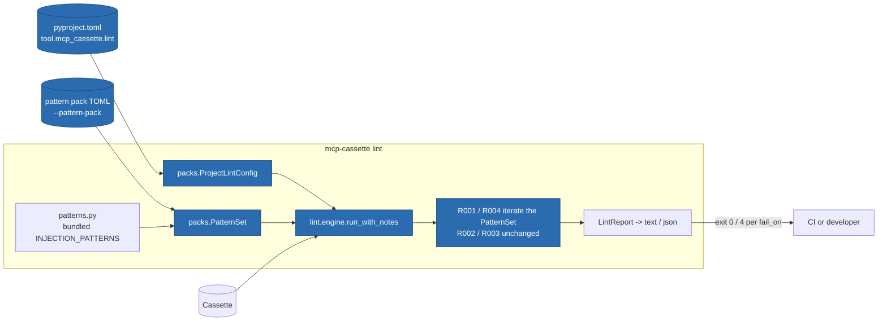

# ITER_04_v3 — Lint pattern packs (v3 MVP terminator)

## §01 · Concept

v2's lint shipped four bundled rules over recorded tool descriptions and results. They
catch generic smells. What they cannot catch is *your* smell: the vendor name that must
never appear in a tool description, the internal hostname that signals a misconfigured
staging server, the domain-specific exfiltration phrasing your threat model cares about.

v3 makes the pattern set extensible **declaratively**: a TOML pattern pack adds labelled
regexes with their own rule ids and severities, and a `[tool.mcp_cassette.lint]` block in
`pyproject.toml` makes a project's packs, selection, and failure threshold the default
for every invocation — so a CI step stays `mcp-cassette lint cassettes/*.mcp.json` while
meaning something project-specific.

What v3 deliberately does **not** add is a Python rule-plugin API. A `Rule` protocol,
`register_rule()`, and entry-point discovery would be a public contract to keep
semver-stable forever, and would make `lint` execute arbitrary third-party code on a
supply-chain-security surface — the one place that is least appropriate. Regex packs
cover the per-project need at a fraction of the API surface. The Python tier is named
and deferred below, not silently omitted.

## §02 · Architecture



**Cassette schema: unchanged** — v3 closes without ever having touched `format_version`,
which stays 2. Lint remains read-only over cassettes.

### Data model — two new configuration entities (loaded, never persisted by us)

| Entity | Fields |
|---|---|
| `PatternRule` (new, pydantic) | `id: str`, `label: str`, `regex: str`, `flags: list[str] = []`, `severity: Literal["warning","error"] = "error"`, `surfaces: list[Literal["description","result"]] = ["description","result"]`, `message: str \| None = None` |
| `PatternSet` (new) | the bundled patterns plus every loaded `PatternRule`, compiled once; exposes `for_surface(surface)` |
| `ProjectLintConfig` (new, pydantic) | `pattern_packs: list[Path] = []`, `select: list[str] = []`, `ignore: list[str] = []`, `fail_on: Literal["error","warning"] = "error"` |
| `LintFinding` / `LintReport` (ITER_04_v2) | **unchanged** — a pack finding is an ordinary finding whose `rule` is the pack's id |

### Pattern pack file format (`--pattern-pack team-rules.toml`)

```toml
version = 1                       # pack format version; only 1 is accepted

[[patterns]]
id = "P001"                       # must not start with "R" (reserved for bundled rules)
label = "exfiltrate-env"          # names the smell in the finding message
regex = '\b(?:env|environ|\.env)\b[^.\n]{0,40}\b(?:send|post|upload|exfiltrat\w*)\b'
flags = ["i"]                     # subset of i, m, s, x
severity = "error"                # default: error
surfaces = ["description"]        # default: both description and result
message = "description describes sending environment variables off-host"  # optional
```

### API surface changed

| Surface | Change |
|---|---|
| CLI `lint` | gains `--pattern-pack PATH` (repeatable), `--fail-on {error,warning}`, `--no-config` |
| `lint.run(...)` / `run_with_notes(...)` | gain `packs: list[str \| os.PathLike[str]] \| None = None` and `config: ProjectLintConfig \| None = None` |
| `lint.packs.load_pack(path) -> list[PatternRule]` | new public loader |
| `lint.packs.discover_config(start=Path.cwd()) -> ProjectLintConfig` | new; walks up to the nearest `pyproject.toml` |
| `__init__.__all__` | gains `PatternRule`, `ProjectLintConfig` |

## §03 · Tech Stack

> Unchanged — see SKELETON_v2 § 03. TOML parsing is stdlib `tomllib` (Python ≥ 3.11;
> this project requires ≥ 3.12). Runtime deps stay `anyio` + `pydantic`. Bundled
> patterns remain plain Python constants in `patterns.py` — SKELETON_v2's "no data-file
> loading machinery" applies to the *bundled* set and is preserved; loading machinery
> exists only for user-supplied packs, which by definition cannot be constants.

## §04 · Backend

### New/changed modules

- `lint/packs.py` — new. `load_pack(path)` reads TOML, validates through pydantic, and
  returns `PatternRule`s; `build_pattern_set(packs)` compiles bundled + pack patterns
  into a `PatternSet`; `discover_config(start)` walks parent directories for the first
  `pyproject.toml` containing `[tool.mcp_cassette.lint]` and validates it into a
  `ProjectLintConfig` (absent file or absent table → defaults, never an error).
- `lint/rules.py` — `match_injection(text)` becomes `PatternSet.match(text, surface)`,
  returning `(rule_id, label, severity, message)` tuples. `rule_r001` and `rule_r004`
  iterate the set instead of the module-level `_COMPILED` list; a bundled match keeps
  emitting `R001`/`R004` with today's severities and message wording, so **existing
  findings are byte-identical to v2**. `rule_r002` and `rule_r003` are untouched.
- `lint/engine.py` — `run_with_notes` accepts the pattern set and the resolved config;
  `enabled` filtering now spans bundled and pack ids uniformly. Sorting stays
  `(locator, rule)`, so determinism holds with packs in play.
- `cli.py` — three new `lint` flags; `_cmd_lint` resolves configuration in the order
  below and computes the exit code from `fail_on`.
- `__init__.py` — two new exports (minor bump; nothing renamed or removed).

### Configuration resolution order (pinned, because "config plus flags" is where tools get vague)

1. Start from `ProjectLintConfig()` defaults.
2. Unless `--no-config`, overlay `[tool.mcp_cassette.lint]` from the nearest
   `pyproject.toml` walking up from the current working directory. Pack paths in the
   config are resolved **relative to that `pyproject.toml`**, not to the cwd — so the
   same CI step works from any subdirectory.
3. Overlay CLI flags. `--pattern-pack` is **additive** to config packs (packs compose;
   a developer adding a personal pack should not lose the team's). `--select`,
   `--ignore`, and `--fail-on` **replace** their config counterparts (a scalar or an
   explicit selection is an override, not a merge).
4. `--select` wins over `--ignore` when a rule id appears in both, and the run prints a
   note naming the id — silently dropping one of two contradictory flags is how a CI
   gate ends up passing for the wrong reason.

### Validation and its error messages (all exit 2, all naming file + key)

- Unreadable/malformed TOML → the `tomllib` error prefixed with the pack path.
- `version` missing or ≠ 1 → *"pattern pack {path}: unsupported version {v} (expected 1)"*.
- Unknown top-level key or unknown key inside `[[patterns]]` → named explicitly
  (pydantic models forbid extra keys) — a typo'd `severty` must not silently disable a
  rule on a security surface.
- `id` starting with `R` → *"pattern pack {path}: rule id 'R005' is reserved for bundled
  rules; use another prefix"*. `id` not matching `^[A-Za-z][A-Za-z0-9_-]{0,15}$` → named.
- Duplicate `id` across all loaded packs → names both pack paths; the second is rejected
  rather than silently shadowing.
- `re.error` compiling a `regex` → names pack, rule id, and the compiler message.
- Unknown flag letter → names the letter and lists the accepted subset (`i`, `m`, `s`, `x`).

### Decisions this iteration pins down

1. **No Python rule API in v3.** Stated in § 01 and repeated in the guide's opening
   line, so a reader looking for `register_rule()` finds the reason rather than an
   absence. Deferred below.
2. **Packs extend, never replace, the bundled rules.** There is no `--no-bundled` flag:
   `--select`/`--ignore` already express every combination, including
   `--ignore R001 --ignore R004`, and a "disable all built-in security rules" switch is
   an attractive nuisance on this surface.
3. **`fail_on = "warning"` is the per-project strictness knob** the deferred item
   really asked for. It changes only the exit code (4 when any finding at or above the
   threshold exists); it never rewrites a finding's severity, so JSON output stays a
   faithful record and two projects can gate the same cassette differently.
4. **Redaction interplay is inherited unchanged.** Pack patterns are matched through the
   same code path that skips `REDACTED` surfaces, so a user pack cannot manufacture
   findings out of redaction markers any more than a bundled rule can.
5. **Pack ids appear verbatim in findings, `--select`, and `--ignore`.** No namespacing
   by pack filename: an id is globally unique by the duplicate check above, and
   `P001` in the output must be the string a developer can paste into `--ignore`.

### Gotchas addressed proactively

- **Cached config breaks tests**: `discover_config` reads the filesystem on every call
  and caches nothing; tests using `tmp_path` + `monkeypatch.chdir` get the config they
  wrote.
- **Untrusted input on a security surface**: pack regexes are compiled but never
  `eval`'d, and no code is imported from a pack — the whole reason the format is
  declarative. Catastrophic-backtracking risk is the pack author's own (their file,
  their CI job); the guide notes it in one line rather than adding a timeout mechanism
  no other rule has.
- **Determinism**: pattern *iteration* order is bundled-first, then packs in load order,
  then rules within a pack — but output order is the existing `(locator, rule)` sort, so
  pack order cannot perturb `--format json` bytes.
- **References that aren't defined anywhere**: `PatternSet` is consumed only by
  `rule_r001`/`rule_r004`; R002 and R003 take no patterns and are untouched.

### Tests for this iteration

- `tests/unit/test_lint_packs.py`: a valid pack loads and fires on a planted phrase with
  its own id/severity/message; `surfaces = ["description"]` fires on a description and
  not on an identical result text (and the converse); `severity = "warning"` yields a
  warning finding and exit 0 under default `fail_on`; every error case in the validation
  list above exits 2 with the file and key named; two packs compose; duplicate ids
  across packs are rejected naming both paths; an `R`-prefixed id is rejected.
- `tests/unit/test_lint_project_config.py`: `[tool.mcp_cassette.lint]` discovered from a
  subdirectory; pack paths resolve relative to `pyproject.toml`; `--no-config` ignores
  it; `--pattern-pack` adds to config packs while `--select` replaces config `select`;
  `--select` + `--ignore` on the same id prints the note and selects; `fail_on
  = "warning"` turns an R003 warning into exit 4 while leaving its severity `warning`
  in JSON output; a missing `pyproject.toml` yields defaults, not an error.
- `tests/unit/test_lint_regression.py`: the v2 fixture cassettes produce **byte-identical**
  `--format json` output before and after this iteration when no packs are configured —
  the guarantee that extensibility did not move the bundled rules.
- `tests/integration/test_cli_lint_packs.py`: end-to-end `lint --pattern-pack` on a
  recorded reference-server cassette (clean → exit 0; with a pack whose regex matches a
  benign description → exit 4 naming `P001` and the JSON pointer).

### Run locally

```
uv run mcp-cassette lint demo.mcp.json --pattern-pack lint/packs/team.toml
uv run mcp-cassette lint demo.mcp.json --fail-on warning --format json
uv run mcp-cassette lint demo.mcp.json --no-config          # ignore pyproject settings
```

Environment variables: none added. The final v3 set is `MCP_CASSETTE_MODE` only —
unchanged since v1, across three major versions.

## §05 · Frontend / Developer Surface

- **CLI:** three new `lint` flags; `--help` keeps the v2 heuristic-honesty sentence and
  adds one line: *"packs extend the bundled rules; they never replace them."*
- **Text output** is unchanged in shape — `P001 error /messages/17/... tool "search":
  <message>` — because a pack finding is an ordinary finding. Nothing in a reader's
  parsing of lint output changes.
- **Docs:**
  - `docs/guide/how-to/lint-pattern-packs.md` (new) — the pack format field by field,
    the resolution order from § 04, `fail_on`, the "no Python rule API and why" line,
    and a starter pack a team can copy.
  - `docs/guide/how-to/redact-secrets.md` gains a cross-reference (redaction hides
    values; packs detect phrasing — different jobs, often confused).
  - `docs/guide/operations/ci.md` gains the two-step recipe: `lint` with the project's
    packs, then `diff --tools-only` from ITER_03_v3, both gating on their own exit code.
  - `README.md`'s linting section gains the pack example; `examples/lint-pack.toml`
    ships a runnable starter pack.
- **Release:** v3 lands as **0.3.0** — every change across the four iterations is
  additive (new exports, new flags, new subcommand, new opt-in behavior); no signature
  in `__all__` changed meaning, and `mcp-cassette lint` / `serve` / `inspect` behave
  identically to 0.2.x when the new flags are absent.

## Out of MVP scope

Consciously deferred — v3's hard edge:

- Python lint rule plugins: a public `Rule` contract, `register_rule()`, and
  entry-point or `--rules-module` discovery (declarative packs are the v3 answer)
- Content-based secret detection in lint (entropy scanning; redaction stays key-structural)
- `async with use_cassette_async(...)` — an async-native entry point without the
  blocking portal
- In-process stdio replay via in-memory streams — feasible only behind an optional
  `mcp-cassette[sdk]` extra and only for agents built on the SDK's `ClientSession`;
  deferred on cost/benefit, not blocked (see ITER_01_v3 § 01)
- Concurrency guard for two sessions sharing one cassette path
- Pacing jitter, statistical latency models, or absolute-timeline reproduction
- Pacing of the record path (recording is always live by definition)
- TUI, pager, or color output for `inspect`/`diff`; any HTML or web viewer
- `diff` on message payloads beyond tool surfaces and the exchange sequence
- Cassette format migration tooling (`format_version` still gates; v3 changed no schema)
- Multi-server orchestration in a single cassette (compose multiple sessions instead)
- Legacy HTTP+SSE transport, resumability replay, OAuth flows (v2's edges, unchanged)
- Response-assertion mode for sampling/elicitation; faults targeting server-initiated
  requests (v2's edges, unchanged)
- Graceful-interrupt finalize for `new_episodes` on either transport
- npm/TypeScript port; packaged GitHub Action
